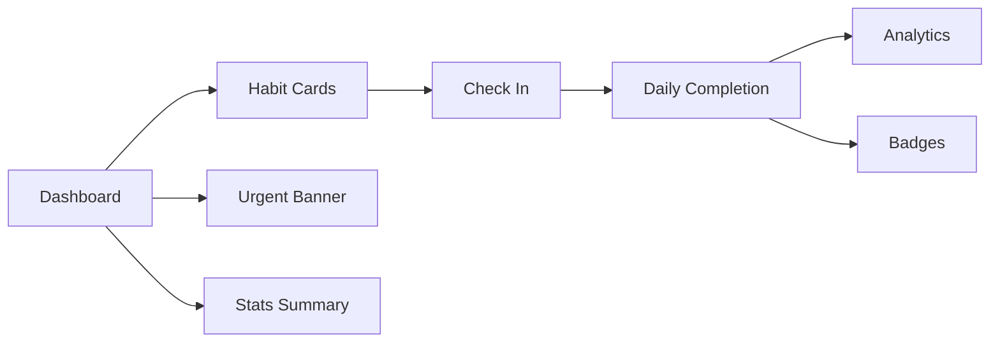
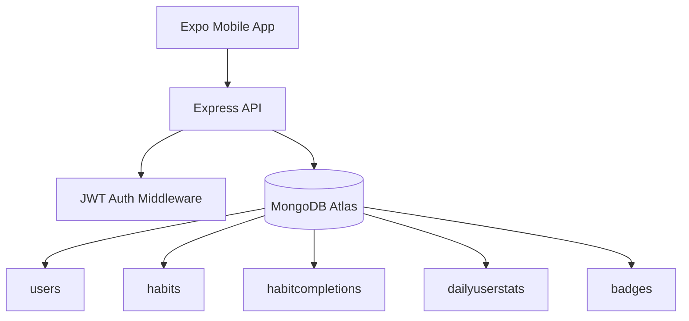
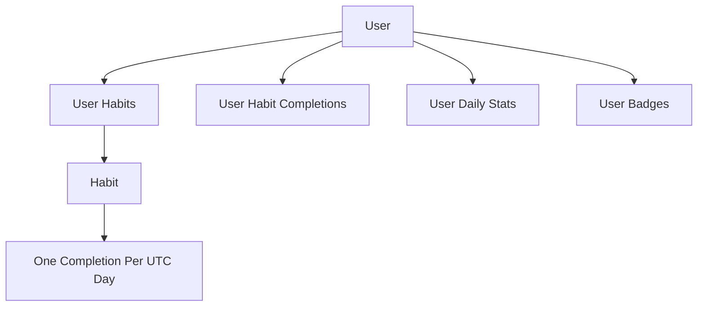
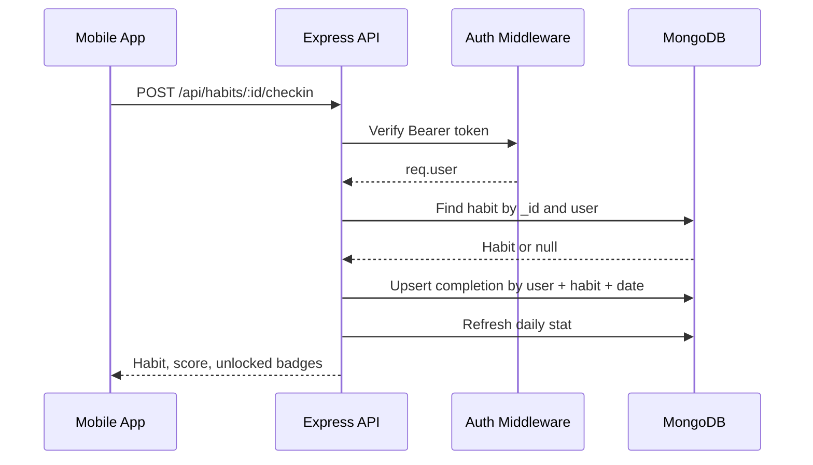
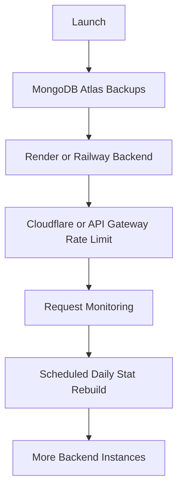

# Consisly

Consisly is a privacy-first habit tracking app built with an Expo mobile client and a Node.js/Express API. It tracks habits, daily check-ins, consistency scores, badges, and real analytics while keeping every user's data isolated by ownership.

## What It Does

- User signup and login with JWT auth
- Private habit storage per user
- Daily habit check-ins with duplicate protection
- Real analytics from completion data
- Badge unlocks for milestones
- Cursor pagination for large habit lists
- Production readiness checks
- Scale-ready daily analytics summaries

## App Preview


## Architecture



## Privacy Model

Every private document stores a `user` field. Controllers never trust a user id from the client; they always use `req.user._id` from the verified JWT.



Safe query pattern:

```js
Habit.findOne({
  _id: habitId,
  user: req.user._id
});
```

## Data Model


## Request Flow



## Tech Stack

| Layer | Technology |
| --- | --- |
| Mobile | Expo, React Native, Expo Router |
| API | Node.js, Express |
| Database | MongoDB, Mongoose |
| Auth | JWT, bcryptjs |
| Security | Helmet, CORS, request size limit |
| Testing | Node built-in test runner |
| Scaling | Cursor pagination, daily summary stats, readiness checks |

## Repository Layout

```txt
consisly
├── backend
│   ├── src
│   │   ├── app.js
│   │   ├── controllers
│   │   ├── middleware
│   │   ├── models
│   │   ├── routes
│   │   └── utils
│   ├── scripts
│   ├── test
│   ├── DATABASE_DESIGN.md
│   └── SCALING_RUNBOOK.md
└── mobile
    ├── app
    ├── src
    └── assets
```

## Backend Setup

```sh
cd backend
npm install
cp .env.example .env
npm run dev
```

Required backend environment:

```txt
PORT=5001
NODE_ENV=development
DATABASE_URL=mongodb+srv://...
JWT_SECRET=replace_this_with_a_long_random_secret
JWT_EXPIRES_IN=30d
CORS_ORIGIN=http://localhost:8081
RATE_LIMIT_MAX=300
RATE_LIMIT_ENABLED=true
```

Useful backend commands:

```sh
npm start
npm run dev
npm run test:api
npm run stats:rebuild -- --days=365
```

Run API tests safely with a test database:

```sh
TEST_DATABASE_URL="mongodb://127.0.0.1:27017/consisly_test" npm run test:api
```

## Mobile Setup

```sh
cd mobile
npm install
npm start
```

Set the deployed API URL for builds:

```txt
EXPO_PUBLIC_API_URL=https://your-backend-domain.com
```

Do not include `/api` at the end. The mobile client adds `/api` automatically.

## Main API Routes

| Method | Route | Description |
| --- | --- | --- |
| `GET` | `/health` | Basic liveness check |
| `GET` | `/ready` | Readiness check with MongoDB status |
| `POST` | `/api/users/register` | Create user |
| `POST` | `/api/users/login` | Login user |
| `GET` | `/api/users/profile` | Current user profile |
| `GET` | `/api/habits` | Current user's habits |
| `GET` | `/api/habits?limit=20&cursor=...` | Cursor-paginated habits |
| `POST` | `/api/habits` | Create habit |
| `PUT` | `/api/habits/:id` | Update owned habit |
| `DELETE` | `/api/habits/:id` | Delete owned habit |
| `POST` | `/api/habits/:id/checkin` | Check in for one day |
| `DELETE` | `/api/habits/:id/checkin` | Remove check-in for one day |
| `GET` | `/api/habits/stats` | Habit summary stats |
| `GET` | `/api/habits/analytics?days=7` | Daily analytics |
| `GET` | `/api/badges` | Current user's badges |

## Analytics Pipeline

```mermaid
flowchart LR
    A[Habit Check-in] --> B[habitcompletions]
    B --> C[Refresh DailyUserStat]
    C --> D[/api/habits/analytics]
    D --> E[Mobile Chart]

    F[stats:rebuild script] --> C
```

## Scaling Checklist



Already implemented:

- Stateless JWT auth
- Owner-scoped database queries
- Separate completion collection
- Unique completion index
- Daily analytics summaries
- Cursor pagination
- Request IDs
- `/ready` endpoint
- Lightweight API tests

Add when traffic grows:

- API gateway or Redis-backed rate limiting
- MongoDB Atlas production backups and alerts
- External monitoring such as Sentry or Better Stack
- Scheduled stat rebuild job
- Multiple backend instances behind a load balancer

## Deployment Recommendation

| Piece | Recommended Service |
| --- | --- |
| Database | MongoDB Atlas |
| Backend API | Render or Railway |
| Mobile app | Expo EAS Build |
| Web app, optional | EAS Hosting or Vercel |

Backend deploy settings:

```txt
Root Directory: backend
Build Command: npm install
Start Command: npm start
Health Check: /ready
```

Production backend env:

```txt
NODE_ENV=production
DATABASE_URL=mongodb+srv://...
JWT_SECRET=long_random_secret
JWT_EXPIRES_IN=30d
CORS_ORIGIN=https://your-web-domain.com
RATE_LIMIT_ENABLED=false
```

Use `RATE_LIMIT_ENABLED=false` when rate limiting is handled by Cloudflare, Render, Railway, NGINX, or another gateway.

## Status

The backend is ready for an early production launch with MongoDB Atlas and a single Node service. It is prepared for growth through pagination, summary stats, request IDs, and stat rebuild scripts.
