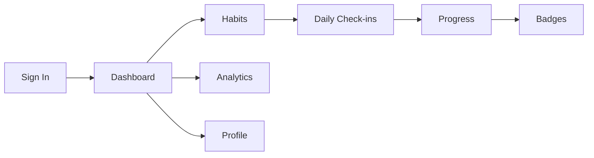
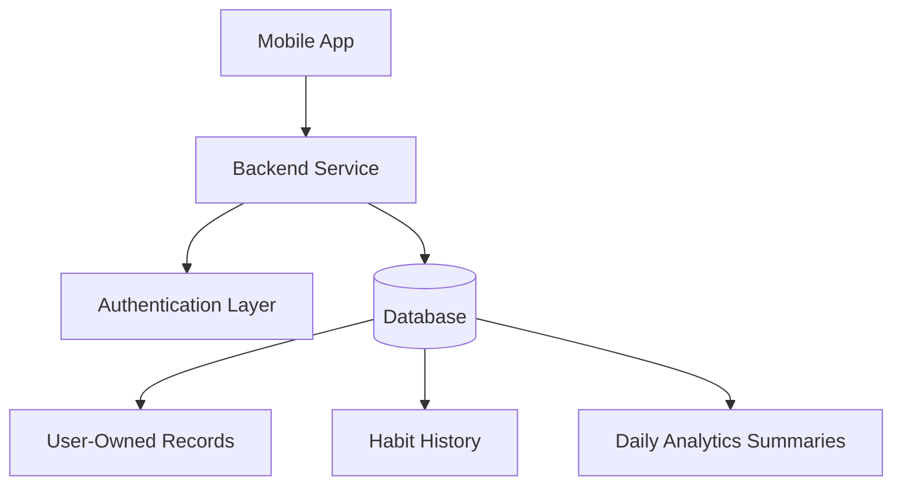
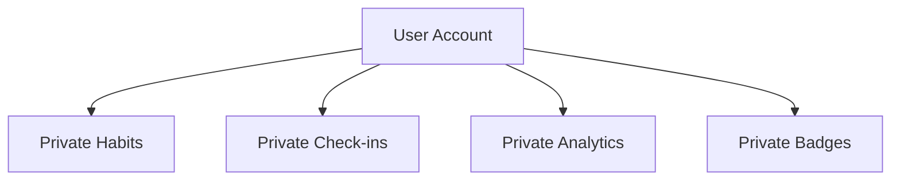
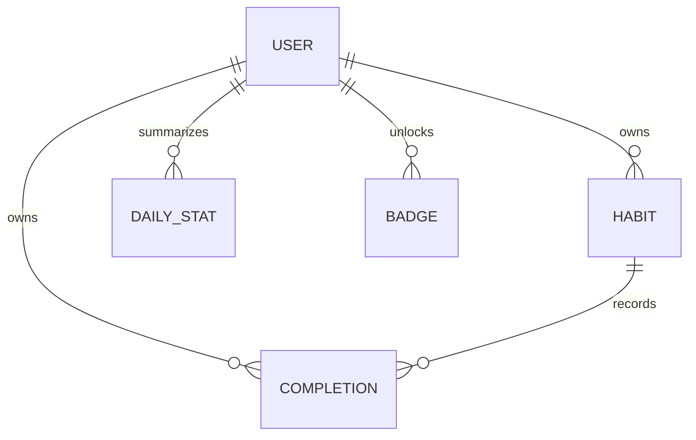
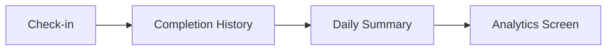
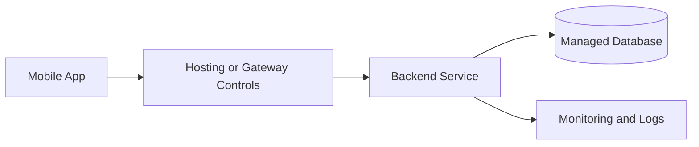

# Consisly

Consisly is a privacy-first habit tracking app for building routines, tracking daily progress, viewing consistency insights, and earning achievement badges.

The project includes a mobile app and a backend service designed around user-owned data, scalable habit history, and production-ready deployment practices.

## Highlights

- Habit creation and daily check-ins
- Progress dashboard with routine cards
- Analytics built from real completion history
- Achievement badge system
- Private user-owned data model
- Mobile pagination for growing habit lists
- Backend readiness checks for deployment
- Lightweight testing and maintenance scripts

## Product Flow



## Architecture Overview



## Privacy-First Data Ownership

Consisly is designed so every private record belongs to a specific authenticated user. Backend data access is scoped through the authenticated user context instead of trusting user identifiers from the client.



## Scalable Data Shape

Habit history is stored separately from habit definitions. This keeps individual habit records small even as users build months or years of completion history.



## Tech Stack

| Layer | Technology |
| --- | --- |
| Mobile | Expo, React Native, Expo Router |
| Backend | Node.js, Express |
| Database | MongoDB, Mongoose |
| Auth | Token-based authentication |
| Security | Request hardening, ownership-scoped data access |
| Scaling | Pagination, summary analytics, readiness checks |

## Repository Structure

```txt
consisly
├── backend
│   ├── src
│   ├── scripts
│   ├── test
│   ├── DATABASE_DESIGN.md
│   └── SCALING_RUNBOOK.md
└── mobile
    ├── app
    ├── src
    └── assets
```

## Backend Capabilities

The backend provides authentication, habit management, check-in tracking, analytics, badges, health readiness, and maintenance utilities.

It is structured so core API behavior can be tested without adding a heavy testing framework.

## Mobile Capabilities

The mobile app includes dashboard, habits, analytics, profile, settings, and habit creation flows. Habit lists use paginated loading so the app remains responsive as user data grows.

## Analytics



Daily summaries keep analytics fast as the completion history grows.

## Deployment Posture

Recommended production shape:



For production, use managed database backups, hosting-level rate limits, log monitoring, and readiness checks.

## Status

Consisly is prepared for an early production launch. The backend has a scalable foundation for user-owned data, habit history, analytics summaries, and operational checks.
